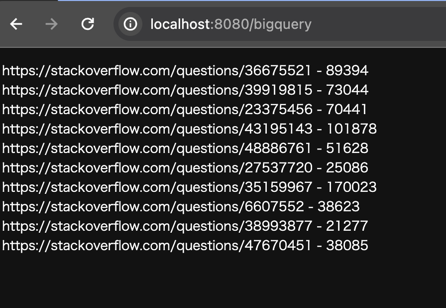

# README.md

このプロジェクトは、QuarkusとGoogle BigQueryを使用して実装されています。以下のリンクを参考にして、gradleとkotlinで開発されています。

https://docs.quarkiverse.io/quarkus-google-cloud-services/main/bigquery.html

## サンプルコード

以下のコードは、`src/main/kotlin/org/acme/BigQuery.kt` ファイルに存在します。  
このクラスは、`/bigquery` パスにGETリクエストを受け付け、BigQueryを使用してクエリを実行し、結果を返します。  
結果は以下に示します。  

以上がこのプロジェクトの概要です。  
詳細な情報や使い方については、[こちらのリンク](https://docs.quarkiverse.io/quarkus-google-cloud-services/main/bigquery.html)を参照してください。
